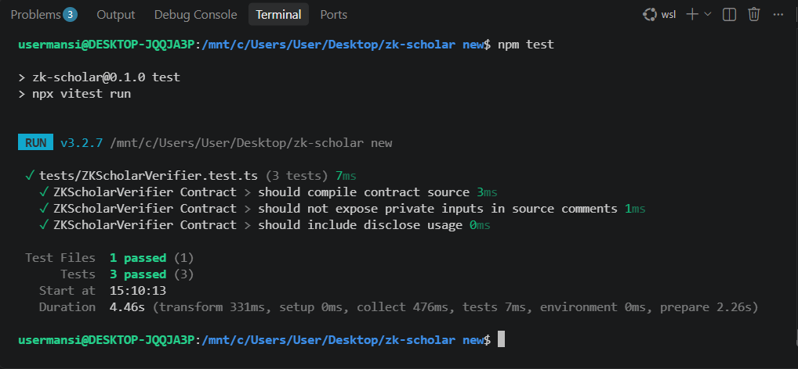

# 🎓 ZK-Scholar

## Privacy-Preserving Scholarship Eligibility Verification on Midnight
## 🌐 Live Demo

🚀 **[ZK-Scholar Live Demo](https://zk-scholar-mugx-git-main-mansisandbhor27s-projects.vercel.app/)**

Privacy-preserving scholarship eligibility verification using Zero-Knowledge Proofs on the Midnight Preview Network.
ZK-Scholar is a privacy-preserving scholarship eligibility verification dApp built on the **Midnight Network** using **Compact smart contracts, Zero-Knowledge Proofs, React, and TypeScript**.

The project demonstrates how students can prove scholarship eligibility without exposing sensitive eligibility information as public blockchain data.

---

## 🏆 Project Highlights

| Feature | Status |
|---|---|
| Midnight Compact Smart Contract | ✅ Implemented |
| Midnight Preview Network | ✅ Deployed |
| Wallet Integration | ✅ Implemented |
| Zero-Knowledge Eligibility Verification | ✅ Implemented |
| On-chain Claim Recording | ✅ Implemented |
| On-chain Claim Counter | ✅ Implemented |
| Program Configuration | ✅ Implemented |
| Contract State via Midnight Indexer | ✅ Implemented |
| Dashboard | ✅ Implemented |
| Claims Dashboard | ✅ Implemented |
| Dynamic Contract Address | ✅ Implemented |
| TypeScript Build | ✅ Passed |
### 🚀 Deployed Smart Contract

The ZK-Scholar Compact smart contract is deployed on the **Midnight Preview Network**.

| Detail | Value |
|---|---|
| Network | Midnight Preview |
| Contract Address | `80de69708ee587e56690a1b1b12a65d850939c59f4307aa82f7ca9de217b6493` |
| Contract Language | Compact |
| State Access | Midnight Indexer |
| Wallet | Midnight Preview Wallet |

The deployed contract is used by the application to:

- Read scholarship program thresholds
- Read the on-chain claim count
- Verify eligibility proofs
- Record verified scholarship claims

**Contract Address:**

```text
80de69708ee587e56690a1b1b12a65d850939c59f4307aa82f7ca9de217b6493
```

## 🔄 Verification Flow

The ZK-Scholar verification flow connects the React frontend, Midnight wallet, Compact smart contract, and Midnight Indexer.

### 1. Scholarship Program Configuration

The administrator creates the scholarship program using `createScholarshipProgram`, providing the minimum score, maximum income, and minimum age thresholds.

### 2. Student Connects Wallet

The student connects the Midnight Preview wallet to authorize contract transactions.

### 3. Eligibility Verification

The frontend calls `proveEligibility(score, income, age)`. The Compact contract checks:

```text
score >= minScore
income < maxIncome
age >= minAge
```

If all conditions pass, eligibility verification succeeds.

### 4. Claim Recording

After successful verification, the frontend calls `recordClaim()`. The contract increments the on-chain `claimCount`.

### 5. Public State and Dashboard

The frontend reads the public contract state through the Midnight Indexer. The Claims Dashboard displays the verified claim count and scholarship program state.

---

# 🔐 Privacy Model

ZK-Scholar is designed to verify scholarship eligibility while minimizing exposure of sensitive student information.

### Private Eligibility Information

The following information is used as eligibility input:


Academic Score, Family Income, Age.

These values are used as private circuit inputs during proof generation. The application does not store the student's exact score, income, or age as public contract ledger state.

### What an Observer Can Learn

- Minimum score threshold
- Maximum income threshold
- Minimum age threshold
- Whether the scholarship program has been created
- Total number of recorded claims
- Public blockchain transaction information associated with contract activity

### What an Observer Cannot Learn

- The student's exact academic score
- The student's exact family income
- The student's exact age

The contract verifies the eligibility conditions without storing the student's exact eligibility values as public ledger state.

Therefore, ZK-Scholar demonstrates an Age / Eligibility Gate privacy model: a student can prove that private information satisfies predefined eligibility requirements without publicly revealing the underlying values.

> Privacy note: Public scholarship thresholds and aggregate claim information are intentionally visible. Sensitive student eligibility values are not recorded as public contract state.

---

# 🧪 Testing

The project includes automated tests using Vitest.

Current local test result: 3 tests passed.

Run tests locally with:

npm test

---

# 🧪 Test Results Screenshot

The automated test suite passes all 3 tests:



---

# 🔄 CI/CD

ZK-Scholar uses GitHub Actions for continuous integration.

The CI workflow installs dependencies, runs automated tests, and runs the TypeScript build check.

Workflow file: .github/workflows/ci.yml

---

# 🛠️ Local Development

## Prerequisites

- Node.js 20+
- npm
- Midnight Preview Wallet
- Midnight Preview Network access

## Install Dependencies

npm install

## Run Tests

npm test

## TypeScript Build Check

npm run build

## Start Frontend

npm run frontend:dev

---

# 🏗️ Technology Stack

- Midnight Network
- Compact Smart Contracts
- Zero-Knowledge Proofs
- React
- TypeScript
- Vite
- Midnight Preview Wallet
- Midnight Indexer
- Vitest
- GitHub Actions

---

# 🎯 Product Idea

ZK-Scholar implements the Age / Eligibility Gate concept.

The goal is to verify whether private information satisfies predefined eligibility requirements without requiring the user to publicly reveal the underlying sensitive values.

This model can be extended to scholarship eligibility, age-restricted access, income-based benefits, academic qualification verification, and other privacy-preserving eligibility systems.

---

# 📌 Project Status

- Midnight Preview deployment
- Wallet integration
- Zero-Knowledge eligibility verification
- Private eligibility inputs
- On-chain claim recording
- Claim counter
- Dashboard
- Automated tests
- GitHub Actions CI
- TypeScript build verification
- Public GitHub repository
- Live demo

# 🎥 Live Demo Video

[▶️ Watch the 1-Minute Live Demo](docs/live-demo.mp4)

